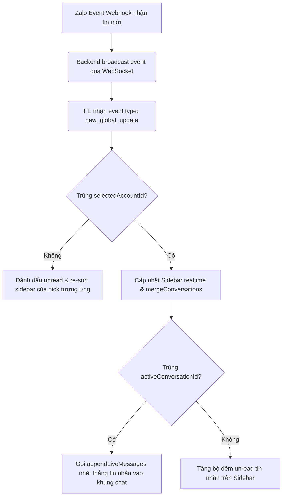

# Kiến trúc & Cơ chế Hoạt động Frontend (FE_ZALO_V2)

Tài liệu này phân tích chi tiết cấu trúc mã nguồn, thiết kế giao diện (UI/UX), luồng quản lý tin nhắn thời gian thực và kịch bản thiết lập chiến dịch trong dự án Frontend Next.js (`FE_ZALO_V2`). Đây là tài liệu tham khảo chuẩn mực để xây dựng các phần mềm quản trị Omni-channel và Automation tương tự.

---

## 1. Cấu trúc Thư mục và Kiến trúc Dự án (Next.js App Router)

Dự án được xây dựng dựa trên Next.js 14+ sử dụng cấu trúc **App Router** kết hợp với kiến trúc quản lý trạng thái tập trung và kết nối bất đồng bộ.

```
src/
├── app/                        # Next.js App Router (Các route và page chính)
│   ├── (admin)/                # Nhóm trang quản trị (Dashboard, Me, Zalo...)
│   │   └── (others-pages)/     # Các phân hệ tính năng Zalo & Chatbot
│   │       ├── zalo-accounts/  # Quản lý tài khoản Zalo & Cấu hình proxy
│   │       ├── zalo-messages/  # Giao diện Chat realtime đa tài khoản
│   │       └── zalo-campaigns/ # Thiết lập chiến dịch bạn bè & nhóm
├── components/                 # Chứa các React component giao diện
│   ├── zalo-accounts/          # Component cho quản lý tài khoản & QR Login
│   ├── zalo-messages/          # Component cho Chat Hub (Composer, Bubble...)
│   └── zalo-campaigns/         # Component cho Form/List các chiến dịch gửi tin
├── stores/                     # Quản lý State toàn cục bằng Zustand
│   ├── use-websocket-store.ts  # Quản lý kết nối & gửi/nhận qua WebSocket
│   ├── use-zalo-messenger-store.ts # Quản lý dữ liệu inbox, tin nhắn và active chat
│   └── use-zalo-account-store.ts   # Quản lý danh sách tài khoản Zalo & Proxy
├── hooks/                      # Custom hooks tái sử dụng
│   └── use-messenger-ws.ts     # Đăng ký listener WebSocket cho tin nhắn realtime
└── services/                   # Định nghĩa các cuộc gọi API REST HTTP
```

---

## 2. Cơ chế Đăng nhập bằng WebSocket QR Code (`zalo-accounts`)

Thay vì gửi request HTTP thông thường, việc lấy mã QR và nhận kết quả đăng nhập Zalo được xử lý hoàn toàn realtime qua kết nối WebSocket nhằm tăng tốc độ phản hồi và chống nghẽn kết nối.

### 2.1 Luồng thực thi (Sequence Flow)
1.  **Mở kết nối**: Khi người dùng vào trang Quản lý tài khoản Zalo, Hook `useMessengerWs` tự động kích hoạt kết nối WebSocket toàn cục (`useWebSocketStore.connect()`) trỏ tới địa chỉ ASGI của Backend.
2.  **Yêu cầu lấy QR**:
    *   Người dùng chọn Proxy (bắt buộc) và bấm nút "Thêm tài khoản Zalo" (hoặc Đăng nhập lại).
    *   FE gửi payload qua WebSocket bằng hàm `send`:
        ```json
        {
          "command": "login_qr",
          "proxy": "http://username:password@ip:port",
          "id_account": 123  // (Chỉ gửi kèm nếu là relogin tài khoản đã có)
        }
        ```
3.  **Nhận mã QR**:
    *   FE lắng nghe sự kiện WebSocket qua hàm `subscribe`. Khi nhận được thông điệp trả về:
        ```json
        {
          "type": "login_qr",
          "qr": "data:image/png;base64,..."
        }
        ```
    *   FE hiển thị ảnh QR (dạng Base64) lên Modal và kích hoạt bộ đếm ngược (countdown) 60 giây chờ quét.
4.  **Xác nhận đăng nhập thành công**:
    *   Khi người dùng quét mã trên điện thoại và đồng ý kết nối, Backend nhận diện session thành công và gửi thông điệp:
        ```json
        {
          "type": "login_qr",
          "result": "success"
        }
        ```
    *   FE nhận được `result: "success"`, hiển thị thông báo thành công (Toast success), tự động đóng modal và gọi hàm `fetchAccounts()` để tải lại danh sách tài khoản mới.

---

## 3. Quản lý Tin nhắn và Chat Realtime (`zalo-messages`)

Giao diện Chat Hub được thiết kế theo cấu trúc cột chia thành 3 khu vực chính:
1.  **Cột Tài khoản Zalo (Account Panel)**: Cho phép chuyển đổi linh hoạt giữa các tài khoản Zalo đã kết nối (hỗ trợ đa tài khoản).
2.  **Cột Cuộc hội thoại (Conversation Panel)**: Hiển thị danh sách phòng chat (cá nhân và nhóm) của tài khoản được chọn, hỗ trợ lọc danh mục nhãn (Labels).
3.  **Khung Chat chính (Chat Panel)**: Hiển thị bong bóng tin nhắn và khung soạn thảo gửi tin.

### 3.1 Luồng nhận tin nhắn Realtime (Inbound Message Stream)


### 3.2 Khung soạn thảo tin nhắn (`ChatComposer.tsx`)
Hỗ trợ đầy đủ các thao tác tương tác cao cấp của Zalo:
*   **Quote/Reply**: Trích dẫn tin nhắn cũ.
*   **Mention (Tag thành viên)**: Khi gõ ký tự `@`, FE hiển thị dropdown gợi ý thành viên nhóm (`MentionSuggestions.tsx`) lấy dữ liệu từ `groupMembers` store.
*   **Sticker**: Tích hợp Sticker Picker truyền tải các bộ sticker Zalo.
*   **Attachment Drafts**: Cho phép kéo thả hình ảnh/video/tài liệu, hiển thị hàng đợi tải lên trước khi gửi.

---

## 4. Thiết lập và Quản lý Chiến dịch (`zalo-campaigns`)

FE hỗ trợ hai loại chiến dịch chính: **Nhắn tin cho Bạn bè** (`send-mes-fr`) và **Nhắn tin trong Nhóm** (`send-mes-group`). Giao diện thiết lập được chia đôi màn hình (Split Panel) để tối ưu không gian làm việc.

### 4.1 Luồng thiết lập Chiến dịch gửi tin Bạn bè
*   **Pane trái (Cấu hình chiến dịch)**:
    *   Nhập tên chiến dịch, thời gian delay giữa các tin nhắn (giây), số lượt gửi tối đa mỗi chu kỳ và mốc giờ cho phép hoạt động.
    *   **Trình soạn thảo nội dung (`SendMesFrContentEditor`)**: Cho phép nhập nhiều nội dung tin nhắn khác nhau (Contents). Nội dung này hỗ trợ định dạng **Spin Text** (ví dụ: `[Xin chào|Chào bạn] [gender] [full_name]`) để ngẫu nhiên hoá câu từ khi gửi.
    *   Đính kèm media: Cho phép chọn hình ảnh tải lên hoặc đính kèm các tài nguyên video/album có sẵn trên hệ thống.
*   **Pane phải (Chọn đối tượng mục tiêu)**:
    *   Tự động fetch danh mục nhãn (Labels) của tài khoản Zalo được chọn để hiển thị bộ lọc nhanh (ví dụ: lọc khách VIP, Khách mới).
    *   Hiển thị danh sách bạn bè dưới dạng checklist. Người dùng có thể tick chọn thủ công từng người hoặc dùng tính năng "Chọn tất cả".
    *   **Quét bạn bè realtime**: Nếu danh sách bạn bè chưa được cập nhật, người dùng bấm "Quét bạn bè". FE gọi API gửi lệnh quét, nhận về `taskId` và tự động poll kiểm tra kết quả (`pollScanResult`) mỗi 3 giây đến khi Backend hoàn thành và cập nhật lại danh sách.
*   **Thực thi**: Khi bấm Lưu, FE gửi toàn bộ cấu hình lên API lưu trữ và kích hoạt Celery Task quét chiến dịch chạy ngầm.

---

## 5. Kinh nghiệm Thiết kế cho các dự án tương tự (Design Principles)

*   **Tách biệt logic qua Zustand Stores**: Giúp quản lý state cực kỳ sạch sẽ. Các component chỉ cần import store và lắng nghe state cụ thể. Khi WebSocket nhận tin nhắn mới, chỉ cần cập nhật dữ liệu trong Store, React sẽ tự động re-render các component liên quan mà không cần viết các hàm callback lồng nhau phức tạp.
*   **Sử dụng Polling cho Long-running Tasks**: Đối với các tác vụ Backend xử lý lâu (như check proxy hàng loạt, quét danh bạn bè Zalo), Backend nên trả về `task_id` ngay lập tức để FE hiển thị trạng thái loading/spinning, sau đó FE chạy setInterval tự động poll API kiểm tra trạng thái của task mỗi 3 giây. Cách tiếp cận này tránh giữ kết nối HTTP quá lâu gây timeout cổng mạng.
*   **Lazy load & Dynamic Import**: Các phân hệ nặng như Chat Hub (`zalo-messages/index.tsx`) sử dụng dynamic import `ssr: false` để giảm kích thước bundle tải trang ban đầu và tối ưu hóa SEO.
